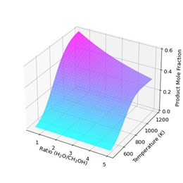

"This repository contains the code for Gibbs Energy Minimisation.
Currently it is designed for reforming/decomposition of hydrocarbons and 
alcohols in the vapor phase. The code accounts for solid carbon deposition, 
which is of key interest when designing a reactor to minimise coking of 
catalysts." 

The goal of this code and repository is to solve for the mninium gibbs energy of a system of various species, achieved through a minimisation process. This informs us about which specie formation is favoured under a variety of conditions. Currently this code is set up to solve for methanol reforming - $CH_{3}OH+H_{2}O \rightarrow .....$

$$
\text{minimise } \sum_{i}^{N} \Delta G_{f,i}^{O} + R T n_i \ln \frac{p n_i}{p_0 \sum+{\text{gas}} n_i}
$$

$ \delta G_{f,i}^{O}(T)$ gibbs formation data is a function of Temperature (K) and pressure of 1atm. This information was sourced for each species from the NIST-JANAF thermochemical tables. 

2 constraints are applied to the solver, including 1. Elemental balance (equality constraint) 2. All $n_i >0$ (non negativity inequality constraint).

Example of results plotting is shown below. Where the species plotted are CO, $CO_2$, $CH_4$, H$_2$, H$_2$O, and C, each as a function of Temperature ($T \in [573, 1173 ]K$) and mole flow ratio between $H_2O:CH_3OH \in [0.5, 5]$. 

### CO Product Mole Fraction

  

